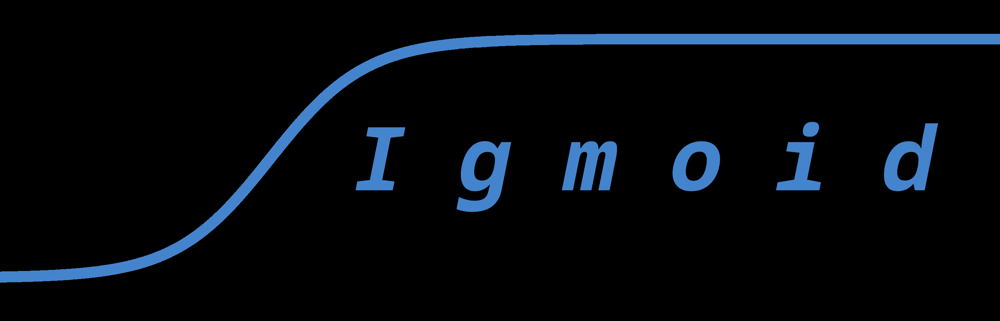

  

UCI chess engine written in C++

 Sometimes decides to kill his own queen to assert dominance and make such an unpredictable move to confuse stockfish.

 Trained on stockfish data for maximum accuracy and less work!

<b>Current State of Testing (Benchmarks):</b>

- Against <b>Stockfish 16:</b> 0 - 100 (sucrificing own queen didn't work)

- Against <b>My Grandma:</b> 1 - 0 (Grandma forgot her glasses)

- Against <b>A literal brick:</b> Draw (Timeout)

